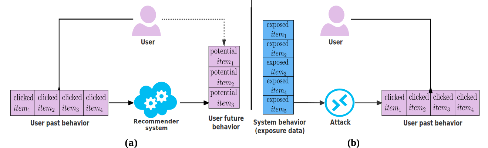
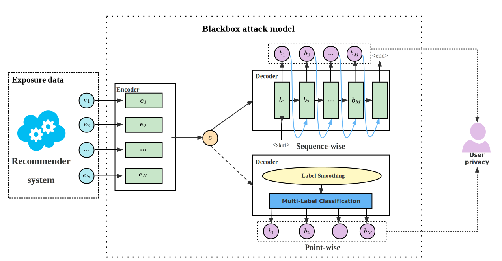
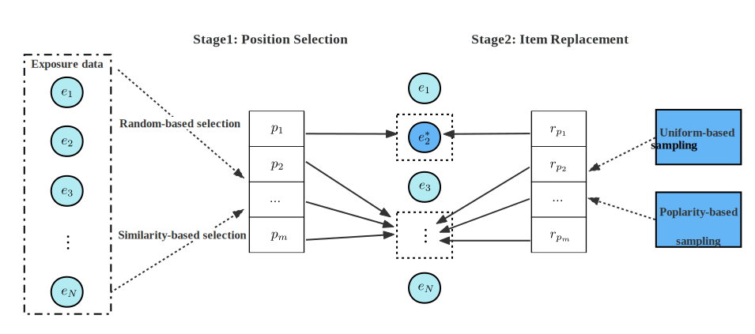

# On the User Behavior Leakage from Recommender System Exposure
This is a PyTorch implementation for the paper:
> Xin Xin, Jiyuan Yang, Hanbing Wang, Jun Ma, Pengjie Ren, Hengliang Luo, Xinlei Shi, Zhumin Chen,
and Zhaochun Ren. On the User Behavior Leakage from Recommender System Exposure

# Overview

In this paper, we investigate the problem of user behavior leakage in the field of recommender systems. We show that the privacy sensitive user past behavior data can be inferred through the modeling of system exposure. In other words, _one can infer which items the **user** have clicked just from the observation of current **system** exposure for this user_. Given the fact that system exposure data could be widely accessed from a relatively larger scope, we believe that the user past behavior privacy has a high risk of leakage in recommender systems. 


More precisely, we conduct an attack model whose input is the current recommended item slate (i.e., system exposure) for the user while the output is the user's historical behavior.  Specifically, we exploit an encoder-decoder structure to construct the attack model and apply different encoding and decoding strategies to verify the attack performance. Experimental results on two real-world datasets indicate a great danger of user behavior leakage. 


To address the risk, we propose a two-stage privacy-protection mechanism which firstly selects a subset of items from the exposure slate and then replaces the selected items with uniform or popularity-based exposure. 
Experimental evaluation reveals a trade-off effect between the recommendation accuracy and the privacy disclosure risk, which is an interesting and important topic for privacy concerns in recommender systems. 

# Requirements
```
pytorch==1.2.0
python==3.7.4
numpy==1.16.5
click==8.0.3
einops==0.1.0
```

# Get started
The default dataset setting of code is zhihu-1M. 

If you want to change dataset to MIND or other, you can replace `dataset`, `exp_item_size` and `his_item_size` in the code to reproduce the results reported in our paper.

And you can change `encoder` and `decoder` arguments to reproduce the more results of Point-wise, LSTM and GRU.
## Attack Framework
```bash
python run_attack.py
```

## Protection Mechanism
To reproduce results of protection mechanism(new attack metrics and recommendation accuracy).
```bash
python run_protection.py
```

```bash
python run_protection_acc.py
```
